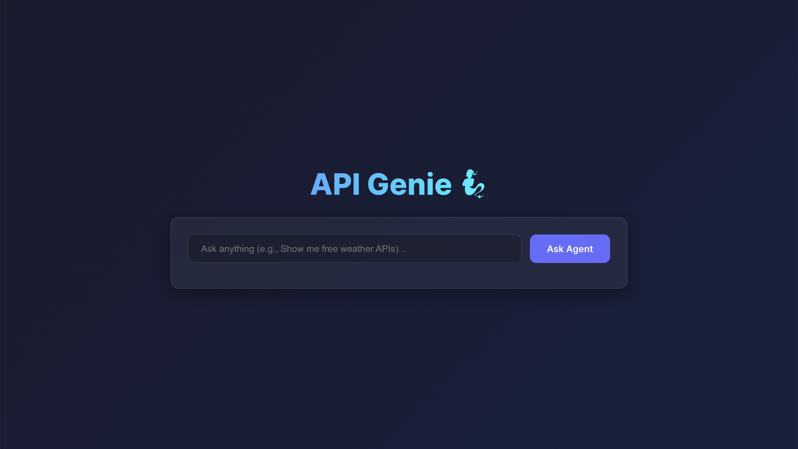

# 🧙‍♂️ API Genie  
**A unified catalog and natural-language interface for exploring public APIs**


---

## 📖 Overview

API Genie is a full-stack project built with **FastAPI**, **PostgreSQL**, and a **React + Vite** frontend.  
It automatically ingests and structures thousands of entries from the [public-apis](https://github.com/public-apis/public-apis) repository into a searchable database.  
The project now features an **AI-powered Agent** that translates natural language queries into SQL to find the perfect API for your needs.

---

## 🧩 Architecture

```
api-genie/
├─ docker-compose.yml         # orchestrates Postgres, backend, and frontend
├─ .env.example               # template for environment variables
├─ db/
│  └─ init/001_schema.sql     # database schema + schema creation
├─ backend/
│  ├─ app/
│  │  ├─ main.py              # FastAPI entrypoint + CORS
│  │  ├─ routers/query.py     # /query route for Agent
│  │  ├─ models.py, deps.py   # models and helpers
│  │  └─ services/            # nl2sql service (Gemini)
│  ├─ pyproject.toml          # backend dependencies
│  └─ README.md
├─ ingestion/
│  ├─ ingest_public_apis.py   # parser + loader for public-apis README
│  ├─ requirements.txt
│  └─ public_apis_README.md   # local copy of upstream README
└─ frontend/
├─ src/
│  ├─ main.tsx, App.tsx    # React/Vite entry + UI logic
│  ├─ App.css              # Modern dark theme styles
│  └─ components/          # Chat, ResultsTable, etc.
├─ vite.config.ts
└─ package.json
```

---

## ⚙️ Setup & Run

### 1️⃣ Prerequisites
- Docker + Docker Compose  
- Node 18+ (for local frontend dev)  
- Python 3.11+ (for ingestion script)
- **Gemini API Key** (for Agent functionality)

---

### 2️⃣ Environment variables

Create `.env` in project root (or copy `.env.example`):

```bash
POSTGRES_USER=api_genie
POSTGRES_PASSWORD=api_genie_pw
POSTGRES_DB=api_genie
POSTGRES_HOST=postgres
POSTGRES_PORT=5432
GEMINI_API_KEY=your_gemini_api_key_here
```

The frontend uses its own env file (`frontend/.env`):

```bash
VITE_API_BASE_URL=http://localhost:8000
```

---

### 3️⃣ Build and run all services

```bash
docker compose up -d --build
```

That will:

* Start PostgreSQL (with schema from `db/init/001_schema.sql`)
* Build and serve the FastAPI backend at [http://localhost:8000](http://localhost:8000)
* Build the Vite frontend at [http://localhost:5173](http://localhost:5173)

---

### 4️⃣ Ingest Public APIs

If you haven’t yet populated the database:

```bash
# Run from host (not inside docker)
cd ingestion
python3 -m venv .venv && source .venv/bin/activate
pip install -r requirements.txt

# Make sure your DB is running via Docker
POSTGRES_HOST=localhost POSTGRES_PORT=5432 POSTGRES_PASSWORD=api_genie_pw \
python ingest_public_apis.py --readme ingestion/public_apis_README.md
```

This loads ~1.4 K APIs from the public-apis README into PostgreSQL.

---

### 5️⃣ Verify everything works

**Backend health check:**

```bash
curl http://localhost:8000/health
```

**Agent Query:**

```bash
curl -X POST http://localhost:8000/query \
  -H "Content-Type: application/json" \
  -d '{"query": "Show me free weather APIs"}'
```

**Frontend:**
Open [http://localhost:5173](http://localhost:5173) in your browser.
You will see a modern, dark-themed UI. Type "Show me free weather APIs" and click "Ask Agent".

---

## 🧠 Features

✅ **AI Agent**: Natural Language to SQL conversion using Gemini 2.0 Flash.\
✅ **Modern UI**: Dark theme, glassmorphism, and responsive design.\
✅ **FastAPI Backend**: Modular and fast python backend.\
✅ **PostgreSQL**: Robust relational database with category-based indexing.\
✅ **Ingestion**: Scrapes all 1.4 K+ entries from public-apis.\
✅ **Dockerized**: Easy setup with hot-reloading for development.

---

## 🧪 Example Queries

* "Show me free weather APIs"
* "Find APIs for cryptocurrency with HTTPS support"
* "List all authentication methods for music APIs"

---

## 🧰 Tech Stack

| Layer            | Technology                         |
| ---------------- | ---------------------------------- |
| Frontend         | React 19 + Vite + TypeScript       |
| Backend          | FastAPI (Python 3.11) + LiteLLM    |
| AI Model         | Gemini 2.0 Flash                   |
| Database         | PostgreSQL 15                      |
| Ingestion        | Python (psycopg2, regex, requests) |
| Containerization | Docker & Docker Compose            |

---

## 🚀 Development

**Frontend (local dev mode)**

```bash
cd frontend
npm install
npm run dev
```

Vite will serve at [http://localhost:5173](http://localhost:5173).

**Backend (local dev mode)**

```bash
cd backend
uvicorn app.main:app --reload --host 0.0.0.0 --port 8000
```

---

## 🧹 Common issues

| Error                                                           | Cause / Fix                                                                                                |
| --------------------------------------------------------------- | ---------------------------------------------------------------------------------------------------------- |
| `psycopg2.OperationalError: connection refused`                 | Backend trying to connect to `localhost` inside container → set `POSTGRES_HOST=postgres` in docker-compose |
| `NetworkError` / `CORS` in browser                              | Add `CORSMiddleware` in FastAPI (already included)                                                         |
| `ON CONFLICT DO UPDATE command cannot affect row a second time` | Duplicate entries in ingestion → dedupe logic fixed                                                        |
| `No entries parsed`                                             | Ensure you downloaded full `public_apis_README.md` (≈ 1,900 lines)                                         |

---

## 📚 User Manual

For detailed instructions on how to use the application, including screenshots, please refer to the **[User Manual](USER_MANUAL.md)**.

---

## 💾 Database Dump

To generate a dump of the database for the final report:

```bash
docker exec -t api_genie_pg pg_dump -U api_genie api_genie > api_genie_dump.sql
```

---

## 🧑‍💻 Contributors

* **Sai Vignesh Naragoni** — AI Agent Developer
* **Anirudh Manjesh** — Backend Developer
* **Varshan Reddy Mallipeddi** — Docker and DB Ingestion
* **Niharika Siddalingaswamy** — Frontend Developer
* Open for pull requests and extensions (AI querying, category analytics, etc.)

---

## 🪪 License

This project is for educational purposes under the **MIT License**.
The ingested data comes from the [Public APIs repository](https://github.com/public-apis/public-apis).

---

**Made with ❤️ using FastAPI, React, and PostgreSQL**