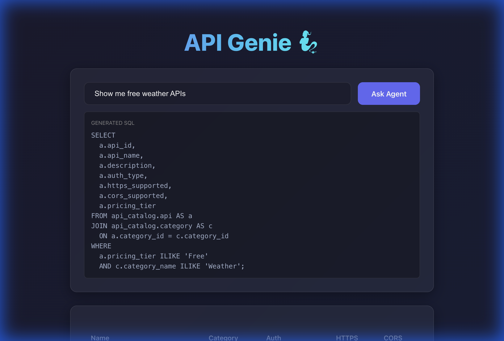

# 🧞‍♂️ API Genie - User Manual

Welcome to **API Genie**, your AI-powered assistant for finding public APIs! This manual will guide you through the features and usage of the application.

## 🚀 Getting Started

1.  **Open the Application**: Navigate to [http://localhost:5173](http://localhost:5173) in your web browser.
2.  **The Interface**: You will see a clean, modern interface with a search bar and an "Ask Agent" button.



---

## 🔍 Features

### 1. AI-Powered Search (Agent)

The core feature of API Genie is the **Natural Language Search**. Instead of guessing keywords, you can simply ask for what you need in plain English.

**How to use:**
1.  Click on the input field that says "Ask anything...".
2.  Type your question. Examples:
    *   *"Show me free weather APIs"*
    *   *"Find cryptocurrency APIs that support HTTPS"*
    *   *"List all music APIs with OAuth authentication"*
3.  Click the **"Ask Agent"** button or press **Enter**.
4.  **Wait a moment**: The AI Agent (Gemini) will process your request, generate a SQL query, and fetch the results from the database.

**Understanding Results:**
*   **Generated SQL**: The application transparently shows the SQL query generated by the AI. This helps you understand how your question was interpreted.
*   **Results Table**: The matching APIs are displayed in a table with key details:
    *   **Name**: The name of the API.
    *   **Category**: The category it belongs to.
    *   **Auth**: The authentication method required (e.g., apiKey, OAuth).
    *   **HTTPS**: Whether HTTPS is supported (✅ or ❌).
    *   **CORS**: Whether Cross-Origin Resource Sharing is supported (✅ or ❌).

### 2. Modern UI/UX

*   **Dark Mode**: The application uses a sleek dark theme with glassmorphism effects for a premium look.
*   **Responsive Design**: The layout adjusts to different screen sizes.
*   **Loading States**: You'll see a "Thinking..." indicator while the Agent is processing your request.

---

## 🛠️ Troubleshooting

*   **"No results found"**: Try rephrasing your query. For example, instead of "weather stuff", try "weather APIs".
*   **"Agent request failed"**: Ensure the backend server is running and the `GEMINI_API_KEY` is correctly set in the `.env` file.
*   **Connection Errors**: Make sure Docker is running and all containers are up (`docker-compose up -d`).

---

## 📊 Database Dump

To export the current state of the database (including all ingested APIs and metadata), run the following command in your terminal:

```bash
docker exec -t api_genie_pg pg_dump -U api_genie api_genie > api_genie_dump.sql
```

This will create a file named `api_genie_dump.sql` in your current directory, which you can submit along with your report.
